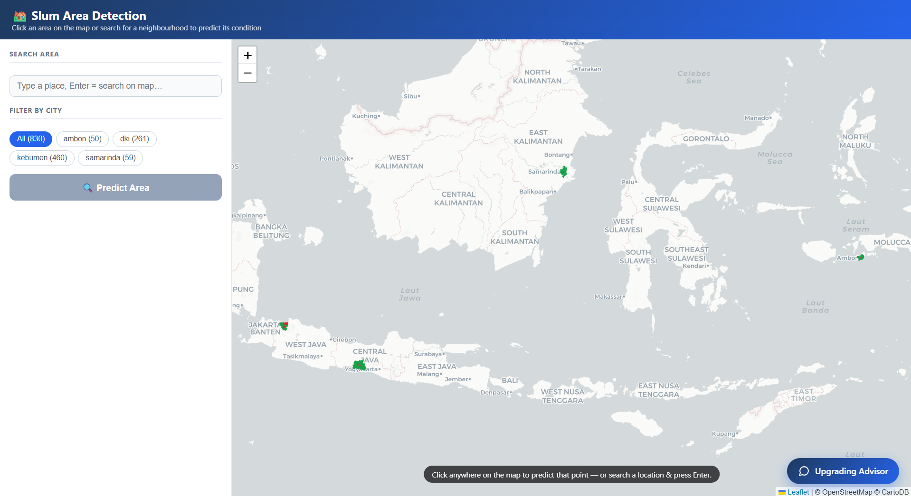
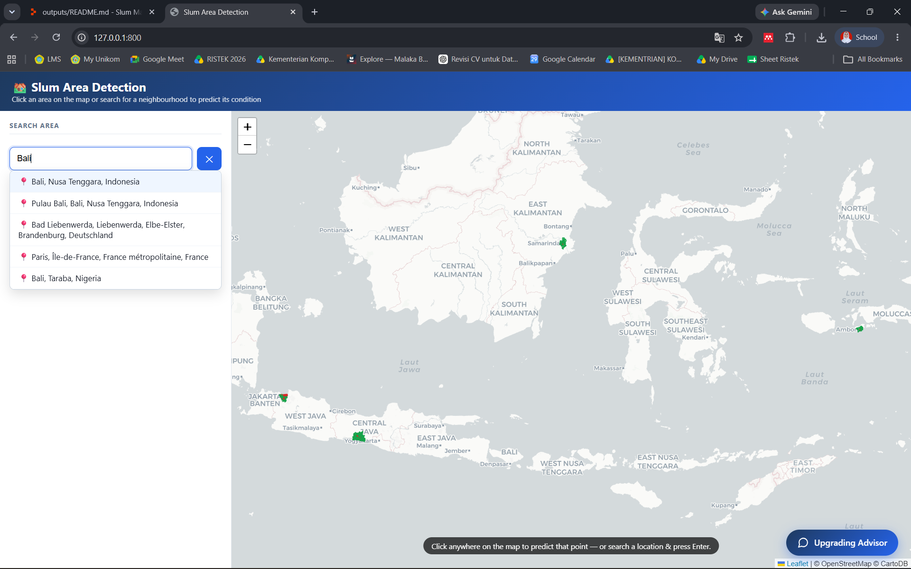
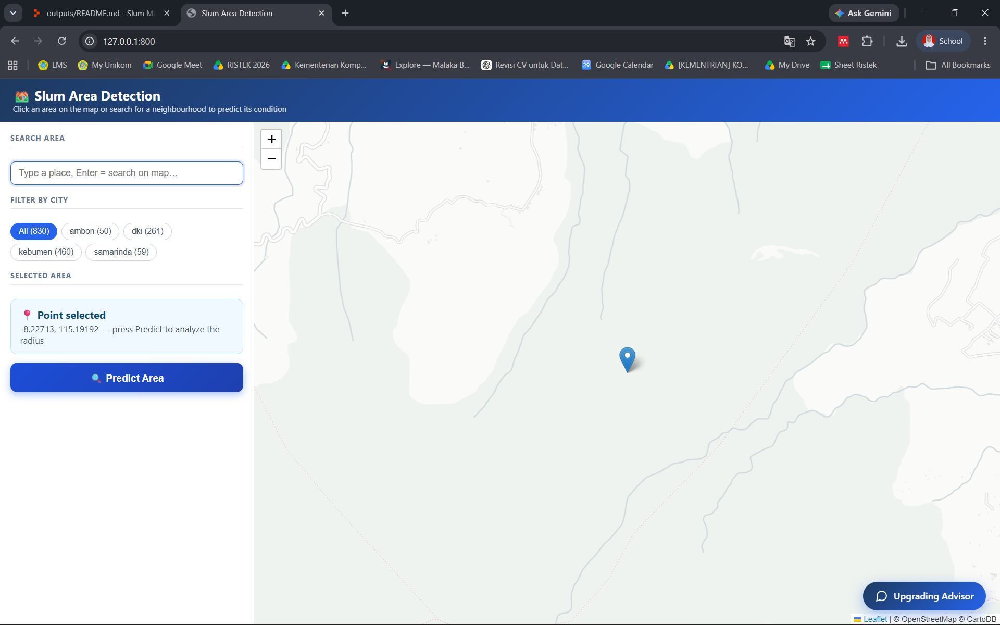
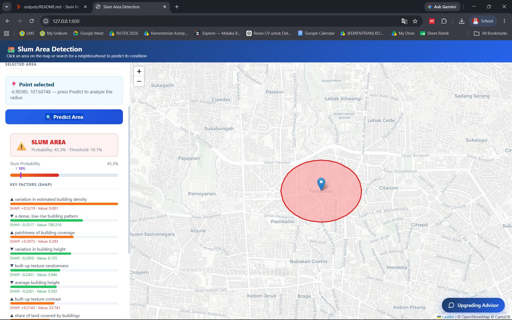
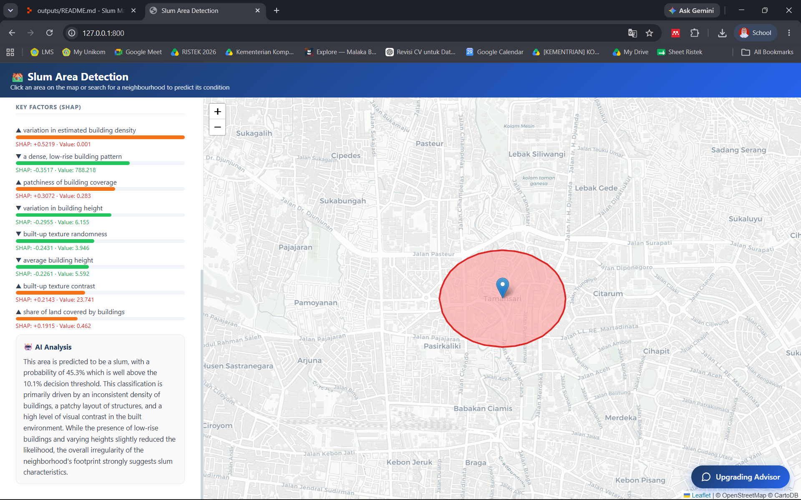
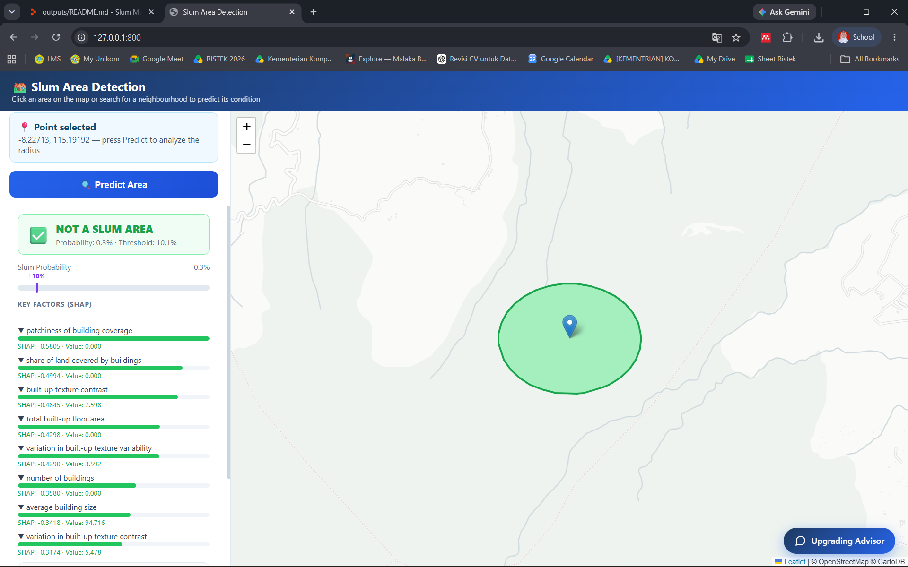
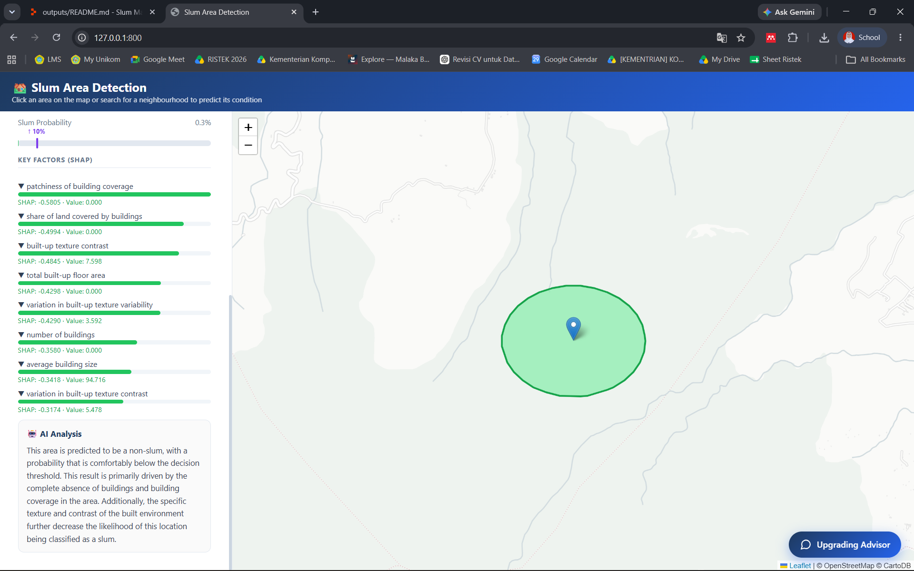
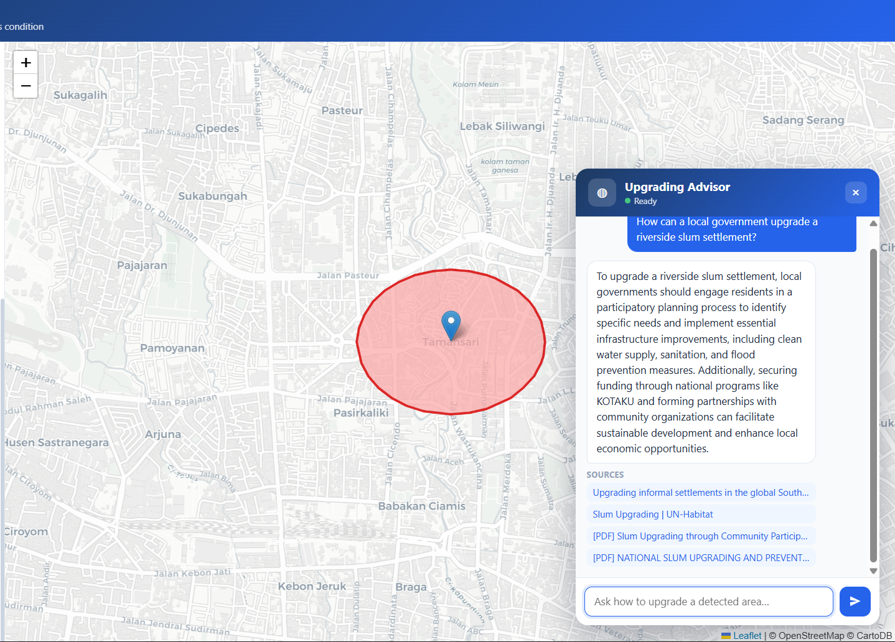

# Urban Pulse — Satellite-Based Slum Area Detection

<p align="center">
  
  
  
  
  
  
</p>

> Urban Pulse is an end-to-end decision-support system that **detects slum (informal-settlement) areas** across Indonesian cities from satellite and geospatial data, **explains every prediction** with SHAP and plain-language reasoning, and pairs the result with an **AI policy advisor** that recommends concrete, web-grounded upgrading strategies for government users. Built for the Datathon competition.

---

## Background

Informal settlements (*permukiman kumuh*) are one of Indonesia's most persistent urban challenges. Mapping them by hand — surveying neighborhood after neighborhood — is slow, expensive, and quickly out of date. Yet governments need this information to target programs, allocate budgets, and measure progress.

Urban Pulse closes two gaps at once:

1. **"Where, and how severe?"** — a machine-learning model classifies each administrative area (kelurahan / RW) as **slum** or **non-slum** directly from satellite-derived features, so a whole city can be screened in minutes instead of months.
2. **"What should we do about it?"** — a built-in AI advisor turns each detected area into actionable, source-cited upgrading recommendations (relevant programs, funding mechanisms, stakeholders, and success indicators).

The result is a single web app where a planner can click a neighborhood on a map, instantly see a risk assessment with the reasons behind it, and ask an assistant how to improve it.

---

## Project Structure

```
Urban Pulse/
├── ai-services/                  # Backend: ML serving + explainability + chatbot
│   ├── app.py                    # FastAPI app & all endpoints
│   ├── model_service.py          # Model load, feature engineering, predict, local SHAP
│   ├── pipeline_service.py       # Point → kelurahan → live Earth Engine feature extraction
│   ├── boundaries_service.py     # Kelurahan polygon loading + city list (no GEE)
│   ├── llm_service.py            # LLM explanation of a prediction (+ deterministic fallback)
│   ├── feature_meta.py           # Human-readable names for each model feature
│   ├── schemas.py                # Request / response models (Pydantic)
│   ├── chatbot/                  # RAG "Upgrading Advisor" (web-search grounded)
│   │   ├── routes.py             # /chatbot/api/chat  &  /chatbot/api/health
│   │   ├── rag_service.py        # Retrieval → context → OpenRouter answer
│   │   ├── search_service.py     # Tavily web-search retrieval
│   │   ├── context_store.py      # SQLite conversation memory
│   │   ├── prompts.py            # System + RAG prompt templates
│   │   ├── config.py             # Settings (pydantic-settings)
│   │   └── ...
│   ├── static/
│   │   └── index.html            # Leaflet map UI + floating chat widget (single page)
│   ├── notebook/                 # EDA, feature building, training & evaluation
│   ├── pyproject.toml            # Python dependencies (managed with uv)
│   └── .python-version
├── models/                       # Trained artifacts
│   ├── slum_xgb_pipeline.joblib  # XGBoost pipeline exported from the notebook
│   └── model_metadata.json       # Threshold, feature list, validation metrics
├── docs/                         # Screenshots used in this README
└── README.md
```

---

## Approach & Methodology

### From segmentation to area-level classification

Slum labels in Indonesia (e.g. the KOTAKU program) are published **per administrative area**, not per pixel. Instead of pixel-wise image segmentation, Urban Pulse reframes the task as **binary classification of an area** (kelurahan / RW): aggregate satellite features over the polygon, then predict slum vs. non-slum. This matches how the ground truth is recorded, is far cheaper to run, and — crucially — yields a model whose decisions can be **explained feature by feature**.

### Feature engineering (Google Earth Engine, 2023 composites)

For every area, features are aggregated from multiple open Earth-observation sources:

| Source | Signal captured |
|--------|-----------------|
| **Google Open Buildings** | building count, density, footprint size & variation, coverage ratio, height mean/variation, presence patchiness |
| **Sentinel-2 (optical)** | NDVI (greenery), NDBI (built-up intensity), BSI (bare soil), brightness, and GLCM **texture** (contrast, entropy/randomness, variability) |
| **Sentinel-1 (SAR radar)** | VV / VH backscatter and the VV/VH ratio — surface roughness, robust to clouds |
| **Engineered interactions** | dense low-rise pattern, packing tightness, built-up-minus-greenery, texture-to-built-up ratio, small-building dominance, and more |

These signals encode the visual fingerprint of informal settlements — dense, small, low-rise, irregular buildings with little vegetation and rough texture.

### Model & threshold

- **Model:** XGBoost gradient-boosted trees inside a scikit-learn pipeline.
- **Recall-first thresholding:** for screening, missing a real slum is worse than a false alarm. The shipped **operating threshold is `0.1013`**, tuned to reach **recall ≥ 0.80** on validation.
- **Honest generalization:** under **Leave-One-City-Out (LOCO)** cross-validation — train on three cities, test on a fully unseen fourth — the model reaches **recall ≈ 0.91 @ threshold 0.185**. LOCO is the headline metric because it reflects performance on cities the model has never seen.

### Explainability

Every prediction returns **local SHAP values**, surfaced in the UI as the *Key Factors* that pushed the area toward (or away from) "slum". Raw feature names are translated to plain English, and an optional LLM turns them into a short narrative — so the output is transparent, not a black box.

### Upgrading Advisor (web-search RAG)

The geospatial model answers *where* and *how severe*. The chatbot answers *what to do*. It runs a **retrieval-augmented pipeline**: a user question triggers a **Tavily web search**, the fresh results are passed as grounded context to an **OpenRouter LLM**, and the answer is returned **with its sources** and tied to the slum/upgrading domain. Conversation memory is kept in SQLite so follow-up questions stay in context.

---

## Evaluation Metrics

The model is evaluated with a recall-oriented, generalization-focused protocol:

- **Recall (slum class)** — primary metric; how many real slum areas are caught.
- **Precision & F1 (slum class)** — false-alarm trade-off.
- **ROC-AUC** — threshold-independent ranking quality.
- **Leave-One-City-Out cross-validation** across the four cities — the honest test of transfer to unseen cities.

Coverage: four Indonesian cities — **Ambon, DKI Jakarta, Kebumen, and Samarinda**.

---

## Tech Stack

### AI / ML & Backend

| Category | Tools |
|----------|-------|
| Modeling | XGBoost, scikit-learn |
| Explainability | SHAP |
| Data processing | NumPy, Pandas |
| Geospatial | Google Earth Engine (`earthengine-api`), GeoPandas, Shapely |
| Satellite data | Sentinel-1, Sentinel-2, Google Open Buildings |
| API server | FastAPI, Uvicorn, Pydantic |
| Packaging | uv + `pyproject.toml` |

### Frontend & Advisor

| Category | Tools |
|----------|-------|
| Map UI | Leaflet (via CDN), vanilla JS — single static page, no build step |
| Advisor LLM | OpenRouter (OpenAI-compatible API) |
| Web retrieval | Tavily Search API |
| Memory | SQLite |

---

## How to Run

### Prerequisites

- **Python 3.11–3.12** and the **[uv](https://github.com/astral-sh/uv)** package manager
- A **Google Earth Engine** account *(optional)* — only needed to predict areas **outside** the bundled local data
- **OpenRouter** and **Tavily** API keys *(optional)* — only needed for the AI Upgrading Advisor

### Steps

```bash
cd ai-services

# 1. Install dependencies
uv sync

# 2. Configure environment
cp .env.example .env          # then fill in the keys you need

# 3. (Optional) authenticate Earth Engine for live, anywhere-in-Indonesia prediction
earthengine authenticate

# 4. Start the server
uvicorn app:app --reload --port 8000
```

Open **http://localhost:8000/** for the map UI, or **http://localhost:8000/docs** for the interactive API documentation.

> The core app (map, boundaries, and prediction for the bundled cities) runs **without any keys or GEE**. Keys only unlock live prediction for unseen areas and the AI advisor.

---

## Environment Configuration

Copy `.env.example` to `.env`. All values are optional — the core API runs without them.

| Variable | Purpose |
|----------|---------|
| `MODELS_DIR` | Folder with the exported model + metadata (default `../models`) |
| `BOUNDARIES_PATH` | Kelurahan polygons for the map + point lookup (default `../data/processed/labels.geojson`) |
| `FEATURES_CSV` | Pre-extracted features for bundled areas → instant prediction, no GEE |
| `GEE_PROJECT` | Earth Engine project id. **Empty = live prediction for unseen areas is disabled** |
| `RADIUS_M` | Buffer radius (m) used when a click falls outside every known area (default `500`) |
| `FEATURE_CACHE_DIR` | Caches freshly extracted features so repeat clicks skip GEE |
| `PIPELINE_YEAR` | Satellite composite year (must match training: `2023`) |
| `OPENAI_API_KEY` / `OPENAI_BASE_URL` / `LLM_MODEL` | LLM for **prediction explanations** (optional; falls back to a deterministic explanation) |
| `OPENROUTER_API_KEY` / `OPENROUTER_MODEL` | LLM for the **Upgrading Advisor** chatbot |
| `TAVILY_API_KEY` | Web search for the **Upgrading Advisor** chatbot |

---

## Using the Application

The web app classifies any chosen location into one of two categories:

| 🟢 NOT A SLUM AREA | 🔴 SLUM AREA |
|---|---|
| Adequate housing density and infrastructure | High density, limited infrastructure, or poor sanitation signals |

### Step 1 — Open the app

Go to **http://localhost:8000/**. An interactive map of Indonesia loads automatically. The left panel holds **SEARCH AREA** (a place search box) and **FILTER BY CITY** chips; the hint at the bottom reads *"Click anywhere on the map to predict that point — or search a location & press Enter."*



### Step 2 — (Optional) Filter by city

Use the **FILTER BY CITY** chips — `All`, `ambon`, `dki`, `kebumen`, `samarinda` (the number on each chip is how many labeled areas it has) — to focus the map on a specific city's areas. `All` shows every bundled area.

### Step 3 — Pick a location

Choose a spot in either of two ways:

- **Search** — type a place in the **SEARCH AREA** box and pick a suggestion from the autocomplete list (or press **Enter**). The map flies to that place and drops a marker.
- **Click the map** — click anywhere directly on the map to drop a marker there.

The left panel then shows **SELECTED AREA → "Point selected `<lat, lon>` — press Predict to analyze the radius"**, and the **Predict Area** button becomes active.




### Step 4 — Press "Predict Area"

Click **Predict Area**. The app analyzes a circular **radius buffer** around the point and draws it on the map, color-coded by the result: **🟢 green = not a slum**, **🔴 red = slum**.

> Predicting an arbitrary point (search or map click) requires `GEE_PROJECT` to be set, because fresh satellite features are fetched for the area.

### Step 5 — Read the prediction

The result card shows:

- the **verdict** — `NOT A SLUM AREA` or `SLUM AREA`;
- the **probability vs. the decision threshold** (e.g. `Probability: 45.3% · Threshold: 10.1%`) and a probability bar;
- **KEY FACTORS (SHAP)** — the features that pushed the result up or down, each with its contribution and value;
- an **AI Analysis** — a short plain-language explanation of the decision.




A location below the threshold is reported as not a slum:




### Step 6 — Ask the Upgrading Advisor

Click **Upgrading Advisor** at the bottom-right to open the chat. Ask how to improve a detected area; the advisor searches the web for current programs, best practices, and funding, then replies in English **with its sources listed**. The status dot shows whether the advisor's services are configured (LLM + web search).



> Predictions are **indicative**, model-based estimates. Always verify on the ground before official decisions.

---

## API Endpoints

| Method | Path | Purpose |
|--------|------|---------|
| GET | `/health` | Liveness, feature count, threshold, whether the live pipeline is enabled |
| GET | `/metadata` | Threshold, required features, engineered formulas, validation metrics |
| POST | `/predict` | Batch prediction from raw features |
| POST | `/explain` | One area from raw features: probability + SHAP + LLM |
| GET | `/predict-by-unit?unit_id=` | Predict a bundled area by id — no GEE needed |
| POST | `/predict-by-point` | Map click/search `{lat,lon,radius_m?}` → cache or live GEE → predict + explain |
| GET | `/areas?city=&q=` | List bundled areas (drives the search) — no GEE needed |
| GET | `/boundaries?city=` | Kelurahan polygons (GeoJSON) for the map — no GEE needed |
| GET | `/geocode?q=` | Geocode a place name to lat/lon (OpenStreetMap proxy) |
| POST | `/chatbot/api/chat` | Ask the Upgrading Advisor `{session_id, question}` → grounded answer + sources |
| GET | `/chatbot/api/health` | Advisor status (LLM ready, search ready) |

---

## Troubleshooting

| Problem | Solution |
|---------|----------|
| Map is blank | Check your internet connection (map tiles load from a CDN), then refresh (F5) |
| "GEE is not active" hint | Set `GEE_PROJECT` in `.env` and run `earthengine authenticate` to predict areas outside the bundled data |
| Clicking outside a city returns 503 | Live prediction needs `GEE_PROJECT`; clicking a bundled (colored) area always works |
| Model fails to load | Use the **same Python/venv** you trained with so `joblib` deserializes the model cleanly |
| Advisor status dot is red/amber | Red = both keys missing or server down; amber = only one of `OPENROUTER_API_KEY` / `TAVILY_API_KEY` set |
| `cannot import name ...` from chatbot | Use package-qualified imports (e.g. `from chatbot.config import get_settings`), not bare module imports |

---

## References

- [Google Earth Engine](https://earthengine.google.com)
- [Google Open Buildings](https://sites.research.google/open-buildings/)
- [Copernicus Sentinel-1 & Sentinel-2](https://dataspace.copernicus.eu)
- [KOTAKU — Ministry of Public Works (PUPR)](https://kotaku.pu.go.id)
- [XGBoost Documentation](https://xgboost.readthedocs.io)
- [SHAP Documentation](https://shap.readthedocs.io)
- [FastAPI Documentation](https://fastapi.tiangolo.com)
- [Leaflet Documentation](https://leafletjs.com)
- [OpenRouter](https://openrouter.ai/docs)
- [Tavily Search API](https://tavily.com)

---

## License

Please refer to the competition's terms for licensing details.
