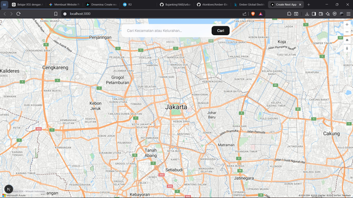
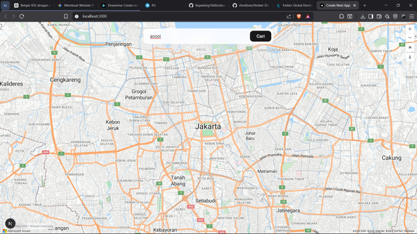
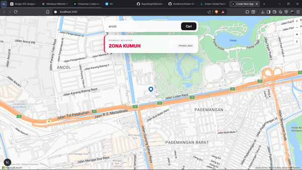
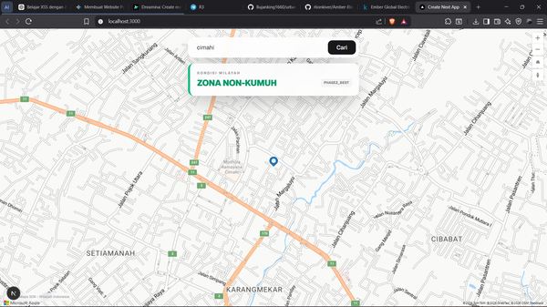

# UrbanPulse — Sistem Deteksi Lingkungan Kumuh Berbasis Citra Satelit

<p align="center">
  
  
  
  
</p>

> Proyek ini dikembangkan dalam rangka kompetisi Datathon. UrbanPulse adalah sistem end-to-end untuk mendeteksi dan memvisualisasikan kawasan kumuh di perkotaan Indonesia menggunakan citra satelit Sentinel-2 dan model deep learning berbasis transfer learning.

---

## Latar Belakang

Kawasan kumuh (*slum area*) merupakan salah satu tantangan urban yang signifikan di Indonesia, terutama di kota-kota besar seperti Jakarta. Identifikasi kawasan kumuh secara manual membutuhkan waktu dan sumber daya yang besar. Proyek ini memanfaatkan citra satelit Sentinel-2 dan model segmentasi semantik berbasis deep learning untuk mengotomatisasi proses deteksi tersebut secara skalabel dan akurat.

---

## Struktur Proyek

```
UrbanPulse/
├── AI Services/                 # Pipeline Machine Learning
│   ├── notebook/                # Jupyter notebooks (EDA, training, evaluasi)
│   ├── scripts/                 # Script download dan preprocessing data
│   ├── outputs_phase1/          # Output dan metrik Phase 1
│   ├── outputs_phase2/          # Output dan metrik Phase 2
│   ├── app.py                   # Entry point API AI Services
│   ├── pyproject.toml           # Dependensi Python
│   └── .python-version          # Versi Python yang digunakan
│
└── Web Apps/                    # Aplikasi Frontend & Backend ML
    ├── app/                     # Next.js app directory (routing & halaman)
    ├── backend-ml/              # Integrasi model ML ke web
    ├── components/              # Komponen React
    ├── src/                     # Source utama aplikasi
    ├── public/                  # Aset statis
    ├── utils/                   # Fungsi utilitas
    ├── package.json             # Dependensi JavaScript
    ├── next.config.ts           # Konfigurasi Next.js
    ├── tsconfig.json            # Konfigurasi TypeScript
    └── .env.example             # Template environment variables
```

---

## Pendekatan & Metodologi

### Model

Proyek ini menggunakan **Prithvi-EO-2.0-100M-TL** — foundation model geospasial dari NASA/IBM yang telah dilatih pada data *Harmonized Landsat Sentinel-2 (HLS)*. Model ini di-*fine-tune* menggunakan arsitektur encoder-decoder via **TerraTorch** untuk tugas segmentasi semantik biner (kumuh vs. non-kumuh).

### Dataset

| Dataset | Sumber | Jumlah | Keterangan |
|--------|--------|--------|------------|
| Argentina Slum | Kaggle | ~45.000 patch TIF | Resolusi 10m, 4 band, patch 32×32 |
| Mumbai Slum | Kaggle | 1 scene besar | Sentinel-2, label `.npy` biner |
| Indonesia (Kotaku) | ArcGIS / Data DKI | 139 TIF + GeoJSON | Per-RW, berlabel, domain target |

### Strategi Transfer Learning

1. **Pre-training domain** — Argentina & Mumbai digunakan untuk mengajarkan pola visual umum kawasan kumuh
2. **Fine-tuning target domain** — Data Indonesia (Kotaku) sebagai domain target utama untuk konteks perkotaan Indonesia

### Metrik Evaluasi

- **IoU per kelas** (Intersection over Union)
- **mIoU** (mean IoU)
- **F1-Score kelas kumuh**
- **Pixel Accuracy**
- **Precision & Recall kelas kumuh**

---

## Tech Stack

### AI Services

| Kategori | Library |
|---------|---------|
| Deep Learning | PyTorch, TerraTorch |
| Computer Vision | Albumentations, segmentation-models-pytorch |
| Geospasial | Rasterio, GeoPandas, Shapely |
| Data Processing | NumPy, Pandas, Xarray, Dask |
| Citra Satelit | Sentinel-2 via Planetary Computer |
| Visualisasi | Matplotlib, Seaborn, Plotly |

### Web Apps

| Kategori | Teknologi |
|---------|-----------|
| Framework | Next.js 16.2 + TypeScript |
| UI | React 19, Tailwind CSS 4 |
| Peta | Azure Maps Control |
| Icons | Lucide React |

---

## Cara Menjalankan

### Prasyarat

**AI Services:** Python 3.11–3.12, NVIDIA GPU + CUDA 12.1, UV package manager

**Web Apps:** Node.js 18+, npm

### AI Services

```bash
cd "AI Services"
uv sync
python scripts/download_kotaku.py
python scripts/download_sentinel2.py
jupyter notebook notebook/
python app.py
```

### Web Apps

```bash
cd "Web Apps"
npm install
cp .env.example .env.local   # isi NEXT_PUBLIC_AZURE_MAPS_KEY
npm run dev
```

Aplikasi berjalan di `http://localhost:3000`

---

## 🔧 Konfigurasi Environment

```env
NEXT_PUBLIC_AZURE_MAPS_KEY=your_azure_maps_api_key
NEXT_PUBLIC_API_BASE_URL=your_api_endpoint_url
```

---

## Fase Pengembangan

### Phase 1 — Eksplorasi & Baseline
- EDA ketiga dataset (Argentina, Mumbai, Indonesia)
- Analisis kompatibilitas band dan resolusi citra
- Pelatihan model baseline → output di `outputs_phase1/`

### Phase 2 — Fine-Tuning & Optimasi
- Fine-tuning Prithvi-EO-2.0 dengan data Indonesia sebagai target domain
- Augmentasi data dan penanganan class imbalance
- Evaluasi metrik IoU, F1, mIoU → output di `outputs_phase2/`

---

## Tutorial Penggunaan Aplikasi

Model yang digunakan pada aplikasi web adalah **PHASE2_BEST** — checkpoint terbaik dari fase fine-tuning. Aplikasi mengklasifikasikan wilayah ke dalam dua kategori:

| 🟢 ZONA NON-KUMUH | 🔴 ZONA KUMUH |
|---|---|
| Wilayah dengan hunian layak dan infrastruktur memadai | Wilayah dengan kepadatan tinggi, infrastruktur terbatas, atau sanitasi buruk |

---

### Langkah 1 — Buka Aplikasi

Akses aplikasi di browser: **`http://localhost:3000`**

Peta interaktif berbasis Azure Maps akan tampil otomatis menampilkan wilayah perkotaan Indonesia.



---

### Langkah 2 — Masukkan Nama Wilayah

Klik kolom pencarian bertuliskan *"Cari Kecamatan atau Kelurahan..."* lalu ketik nama wilayah yang ingin dicek.

> Cukup ketik nama singkat tanpa kata "Kecamatan"/"Kelurahan". Contoh: ketik `ancol`, bukan `Kelurahan Ancol`.



---

### Langkah 3 — Klik Cari

Tekan tombol **"Cari"** atau **Enter**. Peta akan otomatis berpindah (*fly*) ke lokasi wilayah dan marker biru akan muncul di titik tengahnya.

---

### Langkah 4 — Baca Hasil Prediksi

Panel prediksi akan muncul di bagian atas peta. Warna panel menunjukkan hasil klasifikasi model secara visual.

**🔴 Panel Merah → ZONA KUMUH**



**🟢 Panel Hijau → ZONA NON-KUMUH**



> Hasil prediksi bersifat indikatif berdasarkan model ML. Tetap lakukan verifikasi lapangan untuk pengambilan keputusan resmi.

---

### Troubleshooting Aplikasi

| Masalah | Solusi |
|--------|--------|
| Peta tidak muncul / blank | Pastikan koneksi internet aktif, lalu refresh (F5) |
| Pencarian tidak ditemukan | Coba nama lebih singkat atau nama alternatif wilayah |
| Panel prediksi tidak muncul | Pastikan nama diketik benar, tanpa spasi di awal/akhir |
| Peta tidak bergerak ke lokasi | Wilayah belum terdaftar — coba nama kota induknya |
| Tidak bisa akses localhost:3000 | Jalankan `npm run dev` di direktori `Web Apps/` |

---

## Troubleshooting Instalasi

**PyTorch gagal load:**
```bash
uv add torch torchvision torchaudio --index-url https://download.pytorch.org/whl/cu121
```

**Web App build error:**
```bash
rm -rf node_modules && npm install && rm -rf .next
```

**Navigasi folder Windows (nama ada spasi):**
```bash
cd "AI Services"
cd "Web Apps"
```

---

## Referensi

- [Prithvi-EO-2.0 (NASA/IBM)](https://huggingface.co/ibm-nasa-geospatial/Prithvi-EO-2.0-100M-TL)
- [TerraTorch Documentation](https://terratorch.readthedocs.io)
- [Planetary Computer](https://planetarycomputer.microsoft.com)
- [Data Kotaku — Kementerian PUPR](https://kotaku.pu.go.id)
- [Azure Maps Documentation](https://learn.microsoft.com/en-us/azure/azure-maps)
- [Next.js Documentation](https://nextjs.org/docs)

---

## Lisensi

Proyek ini dibuat untuk keperluan kompetisi Datathon. Silakan merujuk pada ketentuan kompetisi untuk informasi lisensi lebih lanjut.